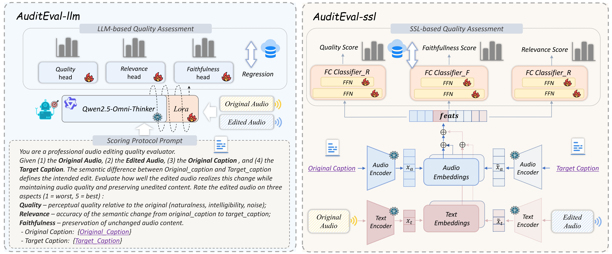
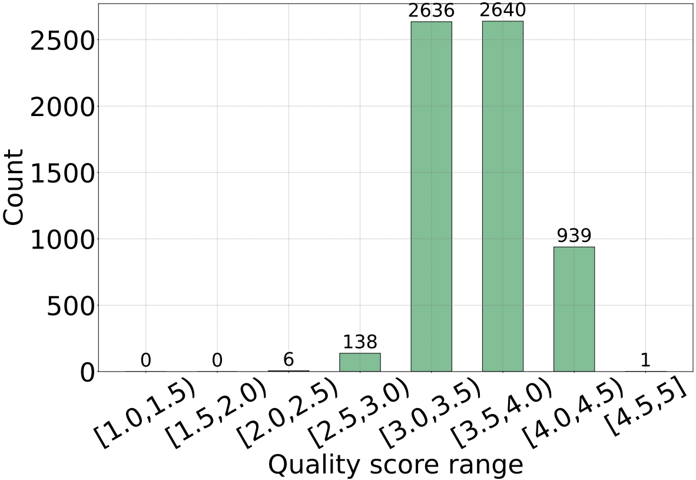
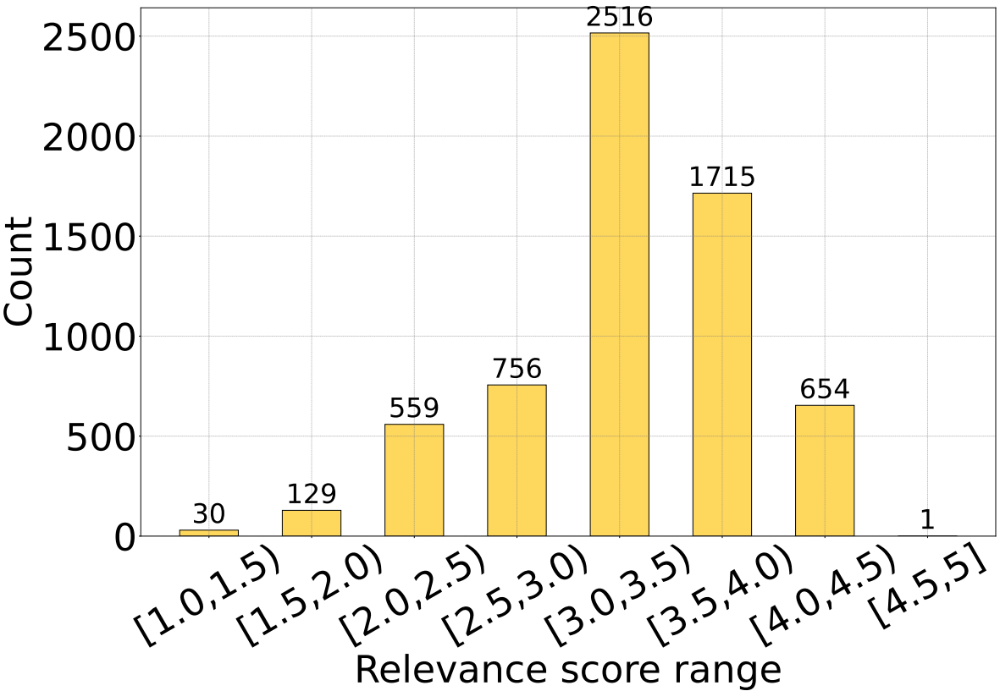
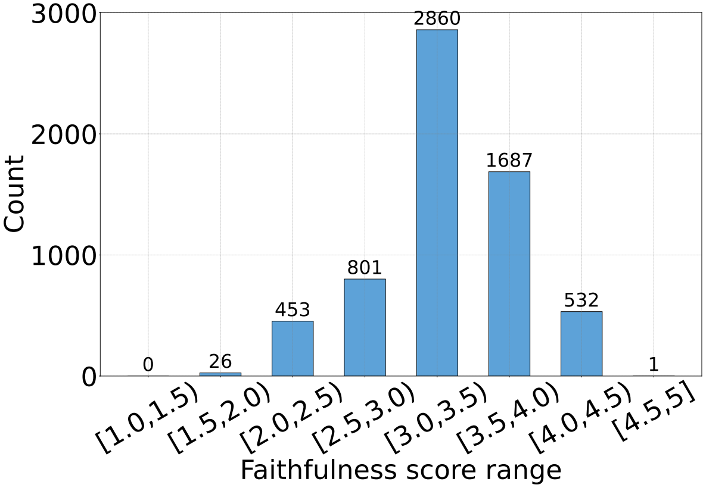
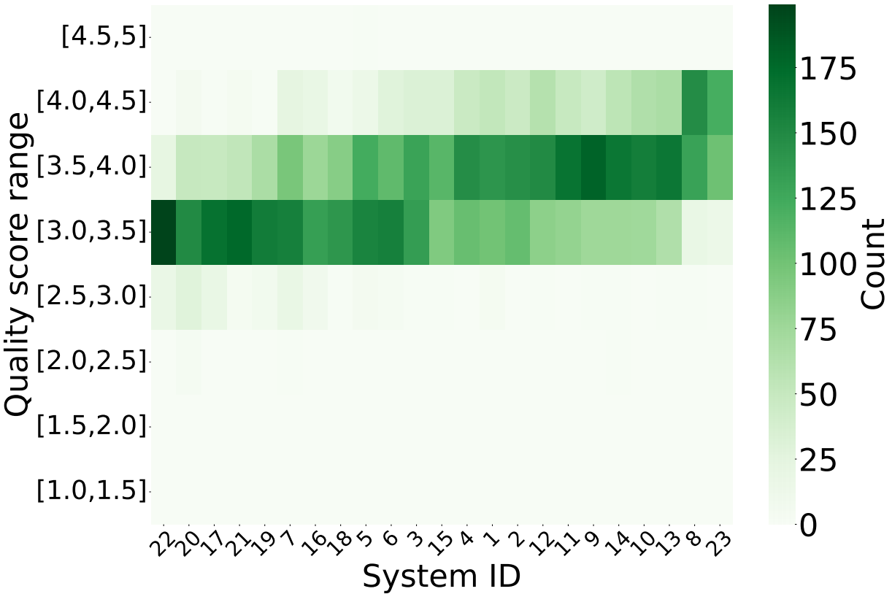
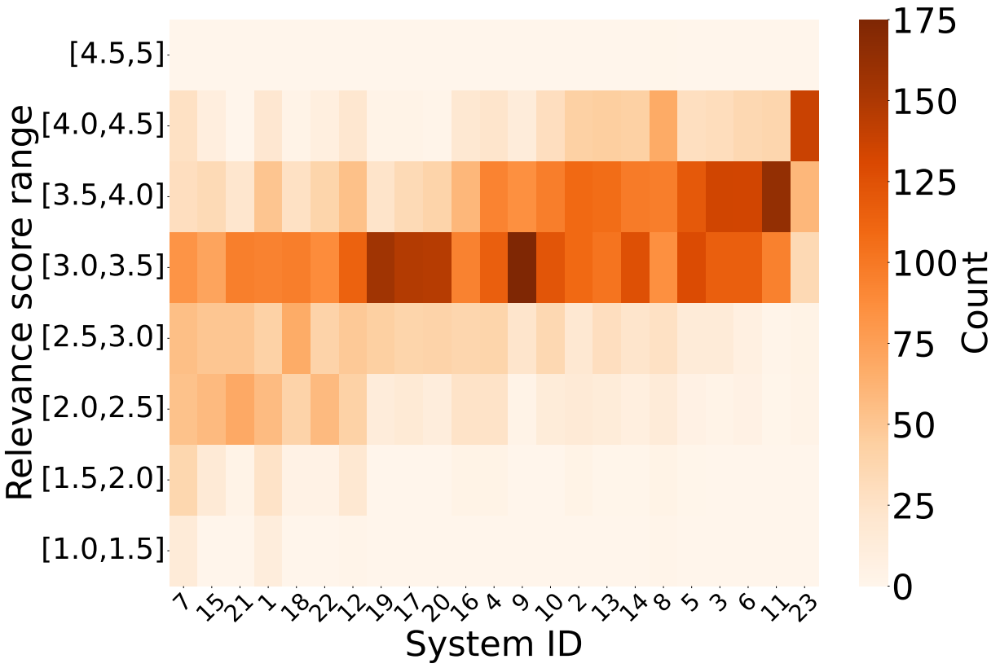
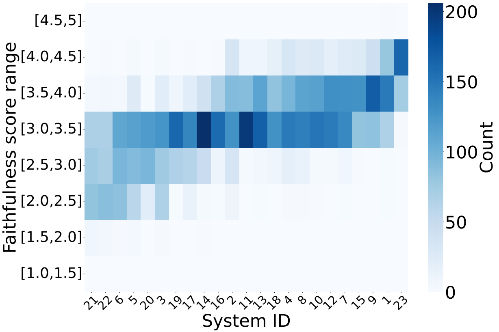

# Towards Automatic Evaluation and High-Quality Pseudo-Parallel Dataset Construction for Audio Editing: A Human-in-the-Loop Method

**[arXiv Link to be added]**

---

## Model Structure



---

## Overview

**Subjective Audio Editing Evaluation Dataset Construction**  
We construct **AuditScore**, the first comprehensive benchmark for subjective audio editing evaluation, consisting of over 6,300 edited samples from 7+ representative frameworks and 23+ system variants. Each sample is annotated by professional raters on three key aspects: **Quality**, **Relevance**, and **Faithfulness**.

**Automatic MOS Prediction**  
Based on AuditScore, we train **AuditEval**, the first model tailored for automatic MOS-style scoring in audio editing. It effectively mitigates the lack of objective metrics and the high cost of human evaluation.

---

## Dataset: AuditScore

AuditScore is a human-annotated dataset comprising **6,360 pairs of original and edited audio samples**, totaling 35.3 hours in duration. These samples are generated using **23 distinct system configurations** across seven representative audio editing approaches.  

**Dataset Figures:**  

<p float="left">
  
  
  
</p>
<p float="left">
  
  
  
</p>

**[Dataset Download Link to be added]**

---

## Model Checkpoints

- **Pretrained CLAP**: [https://huggingface.co/lukewys/laion_clap](https://huggingface.co/lukewys/laion_clap)  
- **AuditEval Quality MLP**: [Link to be added]  
- **AuditEval Relevance MLP**: [Link to be added]  
- **AuditEval Faithfulness MLP**: [Link to be added]  

---

## Using AuditScore MOS-Predictor for Automatic Evaluation

This section describes how to use the AuditScore MOS-predictor tool to automatically evaluate audio editing results:

1. **Configure Inputs**  
   In `pred.py`, specify:
   - Original audio path `ori_path`
   - Edited target audio path `tar_path`
   - Original transcript `ori_text`
   - Editing instruction text `tar_text`

2. **Run Evaluation**  
   Execute the following command to obtain the three scores (Quality, Relevance, Faithfulness) for the audio:
   ```bash
   bash pred.sh
   ```

3. **Train the Model**  
   If you need to train or fine-tune the MOS-predictor, use:
   ```bash
   bash train.sh
   ```

These steps allow quick automatic assessment of audio editing performance, reducing the need for costly human annotations.

---

## Acknowledgements

We thank the authors of **[MusicEval Baseline](https://github.com/NKU-HLT/MusicEval-baseline)** for their valuable reference and resources.
